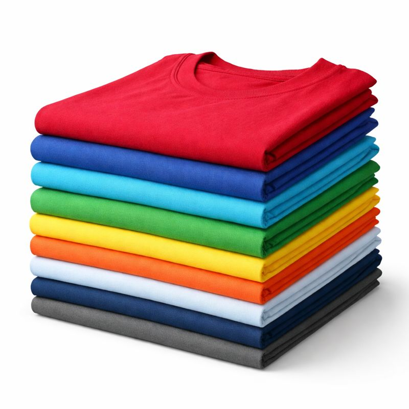

# Image Placement Guide - Catalog Products

## 📁 Folder Structure

Create the following folder structure in your project:

```
abhyglobal_com/
├── images/
│   └── products/
│       ├── t-shirts.jpg
│       ├── cotton-fabrics.jpg
│       ├── kitchen-napkins.jpg
│       ├── turmeric.jpg
│       ├── cumin.jpg
│       ├── coriander.jpg
│       ├── red-chili.jpg
│       ├── garam-masala.jpg
│       ├── consumer-electronics.jpg
│       ├── electronic-components.jpg
│       ├── handicrafts.jpg
│       └── home-decor.jpg
├── index.html
├── catalog.html
├── styles.css
└── logo.png
```

## 📍 T-Shirt Image Placement

### Folder Path:
```
C:\Users\abhis\Website_dev\abhyglobal_com\images\products\
```

### File Name:
```
t-shirts.jpg
```

**Full Path:**
```
C:\Users\abhis\Website_dev\abhyglobal_com\images\products\t-shirts.jpg
```

---

## 📋 All Product Image Names

Use these exact file names (case-sensitive):

### Textiles Category:
1. `t-shirts.jpg` - Premium Cotton T-Shirts
2. `cotton-fabrics.jpg` - Woven Cotton Fabrics
3. `kitchen-napkins.jpg` - Premium Kitchen Napkins

### Spices Category:
4. `turmeric.jpg` - Premium Turmeric Powder
5. `cumin.jpg` - Premium Cumin Seeds
6. `coriander.jpg` - Coriander Seeds & Powder
7. `red-chili.jpg` - Red Chili Varieties
8. `garam-masala.jpg` - Garam Masala Blends

### Electronics Category:
9. `consumer-electronics.jpg` - Consumer Electronics
10. `electronic-components.jpg` - Electronic Components

### Others Category:
11. `handicrafts.jpg` - Indian Handicrafts
12. `home-decor.jpg` - Home Decor Items

---

## 📝 Step-by-Step Instructions

1. **Navigate to your project folder:**
   ```
   C:\Users\abhis\Website_dev\abhyglobal_com\
   ```

2. **Create the images folder:**
   - Create a folder named `images`
   - Inside `images`, create a folder named `products`

3. **Place your t-shirt image:**
   - Save your t-shirt image as: `t-shirts.jpg`
   - Place it in: `images/products/t-shirts.jpg`

4. **Complete path:**
   ```
   C:\Users\abhis\Website_dev\abhyglobal_com\images\products\t-shirts.jpg
   ```

---

## ✅ Naming Convention Rules

- Use lowercase letters
- Use hyphens (-) instead of spaces
- Use .jpg extension (or .png if needed)
- Keep names descriptive but short
- Examples:
  - ✅ `t-shirts.jpg` (correct)
  - ❌ `T-Shirts.jpg` (wrong - avoid uppercase)
  - ❌ `t shirts.jpg` (wrong - avoid spaces)
  - ❌ `t_shirts.jpg` (wrong - use hyphens, not underscores)

---

## 🔗 How Images Will Be Referenced

In `catalog.html`, the image will be referenced as:
```html

```

The path is relative to the `catalog.html` file location.

---

## 📸 Image Requirements Reminder

- **Format:** JPG
- **Size:** 1200px × 800px (recommended)
- **File Size:** Under 200 KB
- **Content:** Professional product photo of t-shirts

---

## 🎯 Quick Checklist

- [ ] Created `images/products/` folder
- [ ] Image saved as `t-shirts.jpg`
- [ ] Image is JPG format
- [ ] Image is optimized (under 200 KB)
- [ ] Image is placed in correct location
- [ ] Ready to update catalog.html with image path

